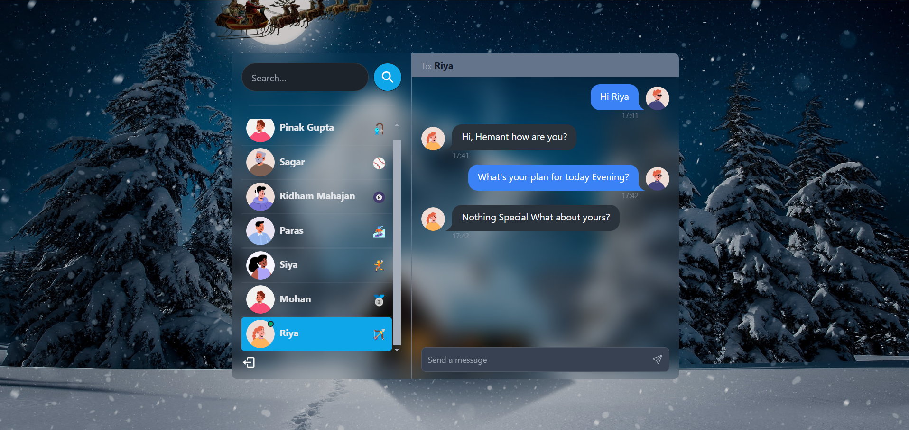
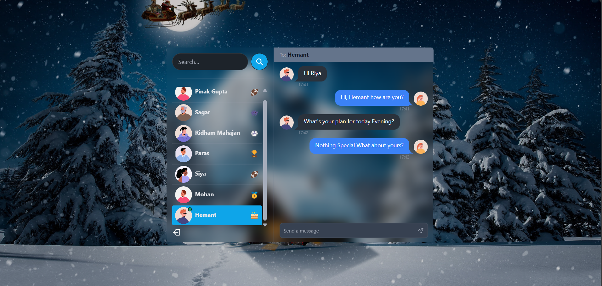
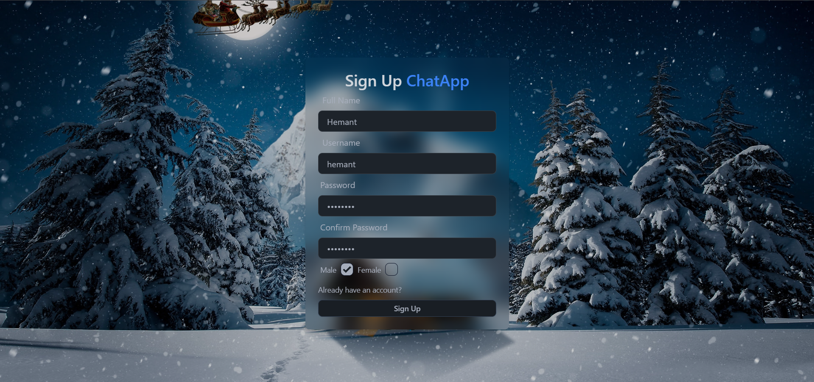
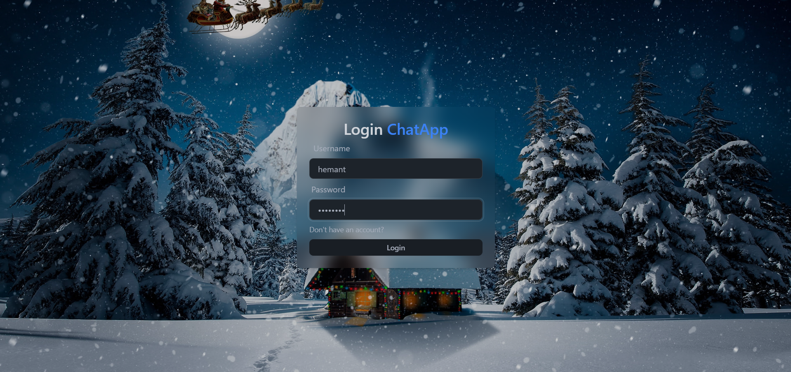

# 📱 Chat-App

Welcome to the Chat-App repository! This project is a real-time chat application built with the MERN stack, enhanced with Socket.io for real-time communication, and styled using TailwindCSS and Daisy UI.

## ✨ Features

- 🌟 **Tech stack**: MERN (MongoDB, Express, React, Node.js) + Socket.io + TailwindCSS + Daisy UI
- 🎃 **Authentication & Authorization**: Secure user authentication and authorization using JWT (JSON Web Tokens)
- 👾 **Real-time messaging**: Instant messaging powered by Socket.io
- 🚀 **Online user status**: Live user status updates using Socket.io and React Context
- 👌 **Global state management**: Efficient state management with Zustand

## 🖼️ Screenshots

### 💬 Chat Feature
In this screenshot, Hemant is chatting with Riya:

**Chat - Screenshot 1**:


**Chat - Screenshot 2**:


### 📝 Signup Page
Simple and intuitive signup process:


### 🔑 Signin Page
Secure and easy signin page:


## 📋 Table of Contents

- [Installation](#installation)
- [Usage](#usage)
- [Features](#features)
- [Screenshots](#screenshots)
- [Contributing](#contributing)
- [License](#license)

## 🚀 Installation

To get a local copy up and running, follow these simple steps:

1. **Clone the repository:**
    ```sh
    git clone https://github.com/your-username/chat-app.git
    ```

2. **Navigate to the project directory:**
    ```sh
    cd chat-app
    ```

3. **Install server dependencies:**
    ```sh
    cd server
    npm install
    ```

4. **Install client dependencies:**
    ```sh
    cd ../client
    npm install
    ```

## 🛠 Usage

1. **Start the server:**
    ```sh
    cd server
    npm start
    ```

2. **Start the client:**
    ```sh
    cd ../client
    npm start
    ```

3. **Open your browser:**
    Navigate to `http://localhost:3000` to see the application in action.


## 🤝 Contributing

Contributions are what make the open source community such an amazing place to learn, inspire, and create. Any contributions you make are **greatly appreciated**.

1. **Fork the Project**
2. **Create your Feature Branch** (`git checkout -b feature/AmazingFeature`)
3. **Commit your Changes** (`git commit -m 'Add some AmazingFeature'`)
4. **Push to the Branch** (`git push origin feature/AmazingFeature`)
5. **Open a Pull Request**

## 📄 License

Distributed under the MIT License. See `LICENSE` for more information.

---

🌟 **Happy Coding!** 🌟
